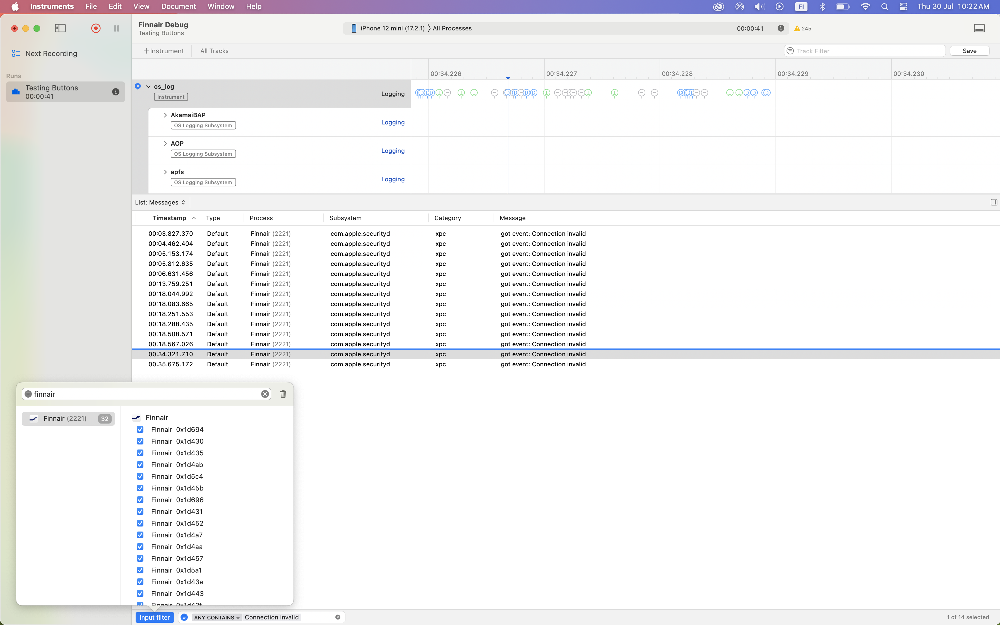

# Finnair mobile app travel extras

## Case details

Company
: Finnair

Date
: 2026-07-26

## Case description

<video width="249" height="540" loop muted autoplay aria-description="Video recording of problems buying travel extras in the Finnair mobile app.">
    <source src="./Finnair-mobile-app-travel-extras.mp4" />
</video>

Love the sneaky travel upgrades in the Finnair app! 💼🕵🏻‍♂️

These buttons would not click through for some reason, which was frustrating. Perhaps it is my iPhone 12 mini on iOS 17.2.1 😅 

Luckily I was able to complete the purchase on the web. 💻🙌🏼

As an unemployed person, should I be spending my last money on this? Surely not! Though I have applied to the Finnair Engagement team as both Product Lead and Lead Developer, so just hire me and problem is solved. 🤩

In any case, I will enjoy the business seat on the 8.5 hour direct flight to Toronto, my home town, over 11 years since the last time. Thank you! 🇨🇦❤️🇫🇮

(Originally published on LinkedIn)

## Debugging & solutions

I reckon it's an ssl compatibility issue.

There are a few things that would improve the app when things go wrong:

1. More clear pressed button styles.
2. Loading state on buttons.
3. Error handling on failed requests with message to user.

