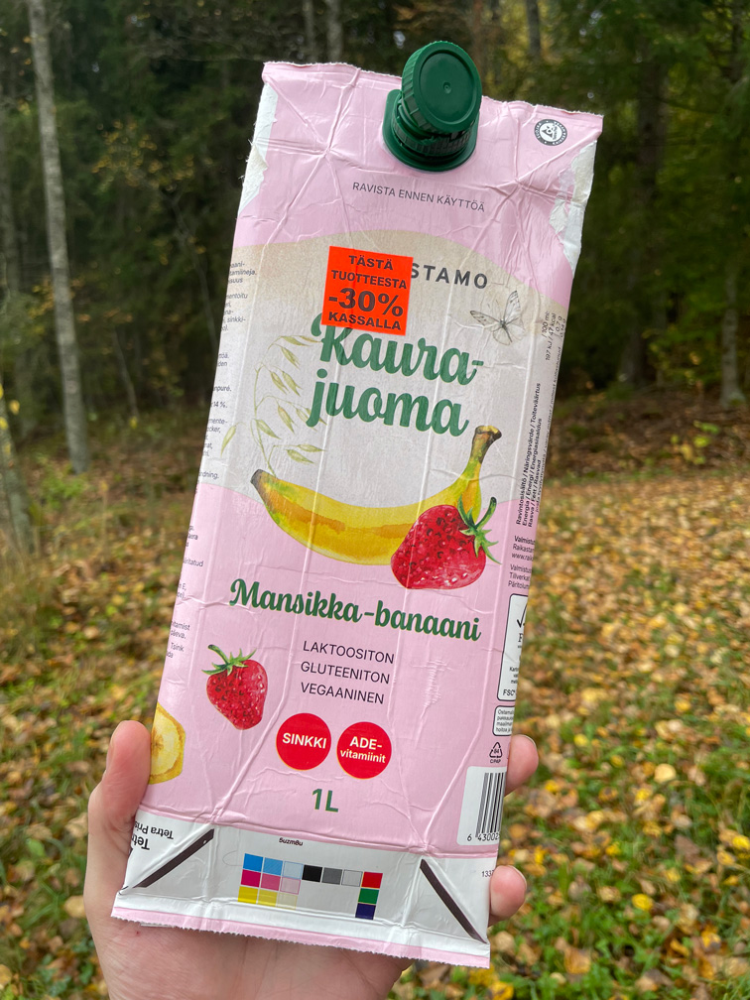
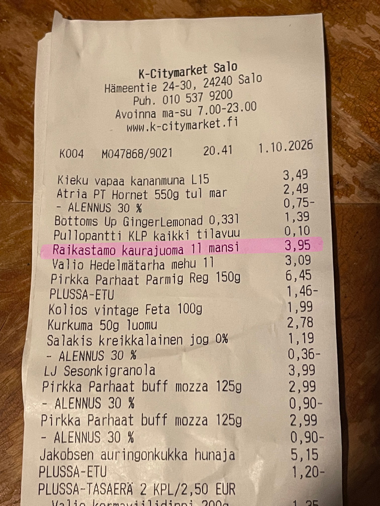

# K-Citymarket product discounts

## Case details

Company
: Kesko

Date
: 2026-10-04

## Case description

During last six months of my unemployment, I've taken advantage of store discounts as much as possible. Since I start a new job tomorrow, I thought I'd take the opportunity to bless you all with one more unsolicited observation about something the business owners are probably well aware of. 😀

Actually I've compiled a few cases of "Fails of User Experience" into a [FUX microblog](https://thomasmoon.github.io/fux/) hosted on GitHub Pages which I hope to develop going forward.

This weekend, I bought a food product that I normally wouldn't have, just because it was on discount. It was a fairly pricy drink, almost 4 e for one litre, but with a high amount of fruit content. I'm not sure about the quality of tap water at my cottage and I certainly need to hydrate!

I got many good deals that day, including some burrata and other proteins. When I checked the receipt after getting home, I noticed that one of the 30% discount items, the fermented oat drink, had slipped through the cracks. The lines are so busy at the store that even if I had noticed it at the store, I'm not sure it could have been remedied easily.

A normal person would probably shrug off the loss, only about 1,20 e. It was, however, the most expensive of the discounted items I bought and there have been days that I've gone to the store with that amount in coins to buy a litre of milk.

Anyways, the drink was good! I didn't want to go all the way back to the store, but since it's a clear case, I figure that they'll give me the credit if I take the empty package back next time.

It did make think about the system overall. Since the discount is indicated only by the sticker on the front of the packaging, it puts an unreasonable burden on the cashier to notice the discount and register it in another step. I have no idea how these discounts are applied at the self-checkout – does the supervisor have to be called for each one?

At my local store Alepa in Helsinki, they stick an orange barcode over the original when the product is discounted. This is a sure way to prevent missing the discounts and works well with the self-checkout. It would seem to require double the amount of products in the database, by requiring a unique code for each discounted item.

As if that wasn't enough complexity, these discounts are automatically doubled to 60% from between 21:00-00:00, so there is some business logic handled in an additional checkout layer. Baked goods, with no stickers, are automatically discounted by -60%, though for these it begins at 22:00 and goes until the next morning when they are removed. The effort that Alepa has put in to develop these various schemes is a credit to their commitment to prevent food waste, while also supporting their relatively new self-checkouts.

The discounts to baked goods were not for a long time applied automatically at the self-checkout. No system is perfect and "knowers tend to know" the limitations, as they say.

## Solutions

My original thoughts around this subject, were that with consistent centralised business rules for product discounts and a unique identifier for each product batch to augment the UPC code, it would be trivial to automate the discounts. This would remove the dependence on cashiers to look for stickers on the packaging and prevent mistakes that could lead to a negative customer experience.

During the process of writing up this case, I've realised what a complex problem this is for super markets, where the UPC code has for ages been the main product identifier.

With an enhanced barcode like the [Code 128 spec](https://en.wikipedia.org/wiki/Code_128) or similarly information dense 2D QR codes that include "application information" it would be possible to apply discounts more easily at checkout but wouldn't do anything to catch the consumer's eye on the shelf. It would also be a big change for producers and wholesalers to apply more dynamic barcodes to individual packages in place of the printed UPC code on the package and stamped expiration date that is usually in a different location.

More awareness about expiry dates at the product level could help with the management of inventory, by directing workers to the products that need sale labels and in eventually clearing them from the shelves. Considering there's unlikely to be better standard for barcodes on food packaging in the immediate future, I can only recommend that Kesko also consider dedicated orange barcodes for the discounted items to reduce the kind of oversight that happened in my case.

I can imagine that this is not a high priority for the business, since mistakes will actually result in larger purchases. Call me an idealist, but I still believe that there's value in getting things right. Reducing returns and improving trust with consumers is surely worth the effort to apply promotions correctly.

It seems to me that there are still a lot of concrete problems to solve in the UX domain. I enjoyed my time as a software consultant until the global AI psychosis further emboldened business leaders who have never properly recognised the importance of UX and design thinking. Clearly there's much value that can be created still through understanding customers, employees and the complex systems on which we all depend.