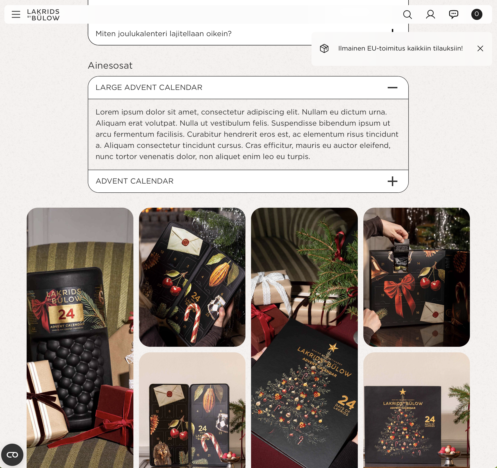

# A rare sighting of critically endangered Lorem ipsum ssp. dolor

## Case details

Company
: Lakrids by Bülow

Date
: 2026-09-27

## Case description

A rare sighting in the wild of the now critically endangered Lorem ipsum ssp. dolor more widely known as "placeholder copy".

Once a commonly encountered visitor to newly established web properties, this important pioneer in the ecological succession of transformed online landscapes was until today considered to be effectively extinct in its native range.

In recent years, it has been displaced from its natural habitat by aggressive competition from invasive species AI content (Textus slopulus). The new animal, seemingly benign, is ultimately non-functional within the same ecological niche, yet harder to recognise for its low quality genetic material that will eventually lead to complete ecosystem collapse.

I encourage the land owners LAKRIDS BY BÜLOW of this last-known foothold (https://lakridsbybulow.fi/joulukalenteri) to study the beast and immediately implement a comprehensive conservation programme. It is our final chance to preserve this last vestige of a simpler time, thought to have been lost already.

No tokens were burned in the generation of this text.

(Originally published on LinkedIn)

Update 2026-10-04: Placeholder text is still in place

